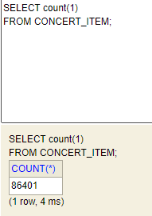
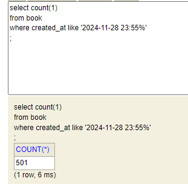
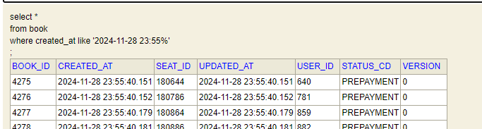
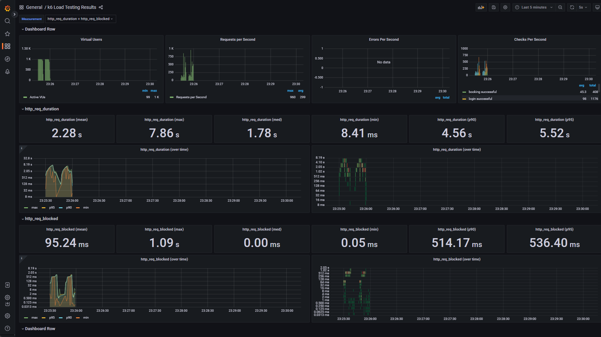
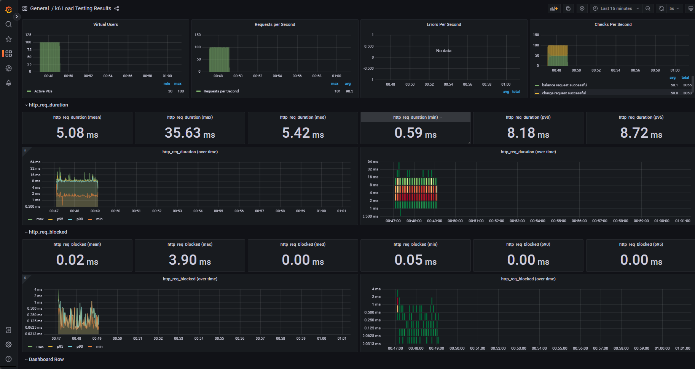

## 시나리오 1 : 콘서트 조회 → 좌석조회 → 로그인 → 토큰발급 → 예약


### 장애 사항

- 부하테스트 시 “콘서트조회” http request timeout

```jsx
WARN[0061] Request Failed                                error="Get \"http://localhost:10180/concert/date?concertd=20241130\": request timeout"         
```

2024-11-30 일자 콘서트 숫자를 8만여건 생성 → 캐시 생성 → 그래도 timeout

현실적으로 한 날짜에 concert 갯수가 8만건이 조회 되는 건 비현실적 → concert_item 수를 줄임.




api 5번 : 1. 콘서트일자조회 2.좌석조회 3. 로그인 4.토큰발급/확인 5.예약

측정한 tps : 1000명 유저 * 각 5번  /  12.9 = 5000 / 13.2 = 약 378 번

응답시간: 13.2 초

```jsx
running (00m13.2s), 0000/1000 VUs, 1000 complete and 0 interrupted iterations
default ✓ [======================================] 1000 VUs  00m13.1s/10m0s  1000/1000 shared iters

     ✓ status is 200
     ✓ login successful
     ✓ token request successful
     ✗ booking successful
      ↳  50% — ✓ 501 / ✗ 499
					// 0~1000 의 숫자 나누기 2 하면 0~500의 총 501개 예약 성공.
		      // 회원번호 나누기 2해서 두 명의 유저씩 하나의 좌석 예약을 경합하도록 함. 

//
INFO[0013] login fail: 1000                              source=console                                                                                 

// 동시성 제어로 인해 기 예약 좌석 실패처리 
INFO[0110] book fail: 817 seatId: 181460 token: 81720241128221431  source=console       

                                                                                                                                                        
```

- 동시성 제어 확인 : 예약 건수 총 501 건 (499건은 예약 실패)





- 시간지표 (1000건)
    - 토큰 token_response_time : 1.6초
    - 예약 book_response_time : 2초
    - 좌석조회 seat_response_time : 2초
    - 콘서트 조회 concert_response_time : 3초
    - 로그인  login_response_time : 2초


```jsx
     book_response_time.............: avg=1381.845526 min=9.0617   med=1614.74345 max=3068.0992 p(90)=1792.065   p(95)=2009.816495
     checks.........................: 90.00% ✓ 4500       ✗ 500
     concert_response_time..........: avg=3122.992149 min=89.2782  med=2897.57655 max=6446.8072 p(90)=5717.53791 p(95)=5983.5695
     data_received..................: 149 MB 11 MB/s
     data_sent......................: 862 kB 66 kB/s
     http_req_blocked...............: avg=66.97ms     min=0s       med=0s         max=1.09s     p(90)=510.59ms   p(95)=516.29ms
     http_req_connecting............: avg=65.57ms     min=0s       med=0s         max=1.01s     p(90)=510.22ms   p(95)=514.96ms
     http_req_duration..............: avg=2.09s       min=9.06ms   med=1.76s      max=6.44s     p(90)=3.91s      p(95)=4.51s
       { expected_response:true }...: avg=2.18s       min=19.14ms  med=1.96s      max=6.44s     p(90)=4.04s      p(95)=4.6s
     http_req_failed................: 10.00% ✓ 500        ✗ 4500
     http_req_receiving.............: avg=5.61ms      min=0s       med=1.22ms     max=140.08ms  p(90)=9.53ms     p(95)=19.2ms
     http_req_sending...............: avg=463.1µs     min=0s       med=0s         max=103.74ms  p(90)=1.07ms     p(95)=2ms
     http_req_tls_handshaking.......: avg=0s          min=0s       med=0s         max=0s        p(90)=0s         p(95)=0s
     http_req_waiting...............: avg=2.09s       min=8.51ms   med=1.75s      max=6.44s     p(90)=3.91s      p(95)=4.5s
     http_reqs......................: 5000   380.024623/s
     iteration_duration.............: avg=11.87s      min=9.52s    med=11.93s     max=13.13s    p(90)=12.92s     p(95)=13s
     iterations.....................: 1000   76.004925/s
     login_response_time............: avg=2036.008437 min=373.4918 med=2297.542   max=4326.8252 p(90)=2663.54114 p(95)=3765.825
     seat_response_time.............: avg=2338.523624 min=392.8099 med=2243.4356  max=4527.0496 p(90)=4078.48048 p(95)=4312.921055
     token_response_time............: avg=1607.878671 min=640.6429 med=1440.2647  max=3021.5683 p(90)=2580.40552 p(95)=2646.556165
     vus............................: 99     min=99       max=1000
     vus_max........................: 1000   min=1000     max=1000

```

⇒ 평균시간이 길게 측정되어서 이상했다.

⇒ 소수 가상사용자로 다시 시도

- 10 명의 가상사용자 부하테스트 시 시간지표
    - 토큰: 10밀리초
    - 예약:  7밀리초
    - 좌석조회: 3밀리초
    - 콘서트 조회 : 51밀리초
    - 로그인 : 2밀리초


```jsx
     book_response_time.............: avg=7.60513  min=3.7688  med=6.1782   max=16.1494 p(90)=12.68593 p(95)=14.417665
     checks.........................: 80.00% ✓ 40        ✗ 10
     concert_response_time..........: avg=51.60297 min=25.6704 med=53.4097  max=80.9483 p(90)=75.23951 p(95)=78.093905
     data_received..................: 1.5 MB 1.3 MB/s
     data_sent......................: 8.6 kB 7.5 kB/s
     http_req_blocked...............: avg=559.65µs min=0s      med=0s       max=3.14ms  p(90)=2.62ms   p(95)=2.62ms
     http_req_connecting............: avg=192.21µs min=0s      med=0s       max=1.61ms  p(90)=607.9µs  p(95)=1.39ms
     http_req_duration..............: avg=15.33ms  min=1.41ms  med=6.31ms   max=80.94ms p(90)=50.82ms  p(95)=64.37ms
       { expected_response:true }...: avg=17.26ms  min=1.41ms  med=6.54ms   max=80.94ms p(90)=57.11ms  p(95)=67.17ms
     http_req_failed................: 20.00% ✓ 10        ✗ 40
     http_req_receiving.............: avg=918.08µs min=0s      med=543.29µs max=8.36ms  p(90)=2.22ms   p(95)=2.55ms
     http_req_sending...............: avg=67.09µs  min=0s      med=0s       max=1.02ms  p(90)=152.86µs p(95)=519.1µs
     http_req_tls_handshaking.......: avg=0s       min=0s      med=0s       max=0s      p(90)=0s       p(95)=0s
     http_req_waiting...............: avg=14.35ms  min=1.14ms  med=5.62ms   max=79.06ms p(90)=43.66ms  p(95)=62.13ms
     http_reqs......................: 50     43.938905/s
     iteration_duration.............: avg=1.12s    min=1.1s    med=1.12s    max=1.13s   p(90)=1.13s    p(95)=1.13s
     iterations.....................: 10     8.787781/s
     login_response_time............: avg=2.68577  min=2.0166  med=2.68     max=3.5044  p(90)=3.3847   p(95)=3.44455
     seat_response_time.............: avg=3.83257  min=1.4138  med=3.58735  max=6.4613  p(90)=4.97846  p(95)=5.71988
     token_response_time............: avg=10.95605 min=6.6262  med=10.20965 max=15.8057 p(90)=15.59321 p(95)=15.699455
     vus............................: 10     min=10      max=10
     vus_max........................: 10     min=10      max=10

```
### 병목 지점 분석
- 콘서트 조회

⇒ 가장 소요시간이 많이 걸리는 api  :  콘서트 조회

콘서트 조회 상태 확인

- 캐시 적용 여부 : 적용

```jsx
    @Cacheable(value = "concertSchedule", key = "#scheduleDate", cacheManager = "concertCacheManager")
    public List<ConcertScheduleDto> getAvailSchedule(String scheduleDate){
```

- 인덱스 적용 여부 : 적용 : 날짜로 콘서트 조회하므로 날짜에 대한 인덱스 적용 상태

```jsx
url : http://localhost:10180/concert/date?concertd=20241129
```

```jsx
@Table(name="concertItem"
    , indexes = @Index(name = "IDX_DATE", columnList = "concertD"))

public class ConcertItemEntity {
```

- 결론 : 2024-11-30 일자 concert_item 갯수가 많아서 어쩔수 없는 현상. (총 3601 건)


- grafana 캡처


---

## 시나리오 2 : 충전 → 잔액조회

### 병목 지점 분석 : 충전

- 잔액조회 api 가 2ms 임에 반해 충전 평균 시간은 7ms 소요.
- 충전 기능은 write 기능이기 때문에 기본적으로 시간이 많이 소요
- 분산락 및 낙관적락이 걸려 있기 때문에 race condition 이 발생할 경우 응답시간이 길어질 수 있음 .

- 러닝 타임: 2분
- 잔액 조회 평균 시간 ( balance_response_time ) : 2ms
- 충전 평균 시간 ( charge_response_time) : 7ms

```jsx
running (2m03.2s), 000/100 VUs, 3055 complete and 0 interrupted iterations
default ✓ [======================================] 100 VUs  2m0s

     ✓ charge request successful
     ✓ balance request successful

     balance_response_time..........: avg=2.527945 min=1.0472  med=2.5021 max=14.8177 p(90)=3.093    p(95)=3.30287
     charge_response_time...........: avg=7.608794 min=4.8265  med=7.4669 max=28.759  p(90)=8.7065   p(95)=9.12313
     checks.........................: 100.00% ✓ 6110      ✗ 0
     data_received..................: 1.0 MB  8.3 kB/s
     data_sent......................: 687 kB  5.6 kB/s
     http_req_blocked...............: avg=19.7µs   min=0s      med=0s     max=2.5ms   p(90)=0s       p(95)=0s
     http_req_connecting............: avg=13.57µs  min=0s      med=0s     max=1.79ms  p(90)=0s       p(95)=0s
     http_req_duration..............: avg=5.06ms   min=1.04ms  med=5.45ms max=28.75ms p(90)=8.23ms   p(95)=8.71ms
       { expected_response:true }...: avg=5.06ms   min=1.04ms  med=5.45ms max=28.75ms p(90)=8.23ms   p(95)=8.71ms
     ✓ { scenario:balance }.........: avg=2.52ms   min=1.04ms  med=2.5ms  max=14.81ms p(90)=3.09ms   p(95)=3.3ms
     ✓ { scenario:charge }..........: avg=7.6ms    min=4.82ms  med=7.46ms max=28.75ms p(90)=8.7ms    p(95)=9.12ms
     http_req_failed................: 0.00%   ✓ 0         ✗ 6110
     http_req_receiving.............: avg=293.07µs min=0s      med=54.5µs max=2.04ms  p(90)=712.37µs p(95)=967.35µs
     http_req_sending...............: avg=19.59µs  min=0s      med=0s     max=1.02ms  p(90)=0s       p(95)=96.38µs
     http_req_tls_handshaking.......: avg=0s       min=0s      med=0s     max=0s      p(90)=0s       p(95)=0s
     http_req_waiting...............: avg=4.75ms   min=513.1µs med=5.07ms max=27.66ms p(90)=7.99ms   p(95)=8.48ms
     http_reqs......................: 6110    49.595797/s
     iteration_duration.............: avg=3.98s    min=2.99s   med=3.99s  max=5s      p(90)=4.01s    p(95)=4.03s
     iterations.....................: 3055    24.797899/s
     vus............................: 10      min=10      max=100
     vus_max........................: 100     min=100     max=100

```

- grafana 캡처


## 가상 장애 상황 대응 매뉴얼

- **장애 대응 프로세스**
    - **장애 탐지**
        - gloabalExeptionHandler 로 예외 catch
    - **장애 분류 및 전파**
        - 예외 catch 로직에서 Error 수준의 log 발생 → slack 으로 운영 담당자에 전송
    - **장애 복구 및 보고**
        - 로그를 통해 어느 쪽이 장애가 났는지 판단.
        - 문제가 된 모듈 재 배포 시도
        - 소스코드의 문제 시 이전 반영 버전으로 배포
    - **장애 상황 해소 통지**
        - 장애 해소 시 사용자들에게 공지
    - **장애 회고**
        - 장애 상황 로그 저장 및 보고서 작성

- 장애 피해를 줄이기 위한 방안
    - spring resilience4j 이용
    - 아래와 같이 redis , kafka 같은 메시지 큐 이상 시 서킷브레이커를 통한 fallback 메서드 구현으로 장애 상황 판단 및 심각한 에러로 이어지지 않게 대응.


```jsx
    @CircuitBreaker(name = "redisWaitEnqueue", fallbackMethod = "fallbackEnqueue")
    public void waitEnqueue(String queueName, String tokenValue, double score) {
        waitQueue.add(WAIT_QUEUE+queueName, tokenValue, score);
    }
    
    public String fallbackEnqueue(String queueName, String tokenValue, double score, Throwable t) {
        // Redis가 실패했을 때 호출되는 fallback 메소드
        return "Fallback data for enqueue: " + queueName;
    }
}
```

