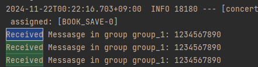
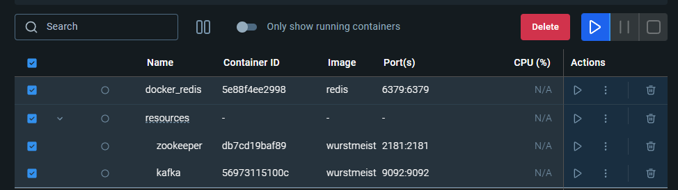

### docker-compose.yml 설정

```jsx
version: '3.8'
services:
  zookeeper:
    image: wurstmeister/zookeeper:latest
    container_name: zookeeper
    ports:
      - "2181:2181"
  kafka:
    image: wurstmeister/kafka:latest
    container_name: kafka
    ports:
      - "9092:9092"
    environment:
      KAFKA_ADVERTISED_HOST_NAME: 127.0.0.1
      KAFKA_ZOOKEEPER_CONNECT: zookeeper:2181
      KAFKA_ADVERTISED_LISTENERS: PLAINTEXT://127.0.0.1:9092
      KAFKA_LISTENER_SECURITY_PROTOCOL_MAP: PLAINTEXT:PLAINTEXT
      KAFKA_INTER_BROKER_LISTENER_NAME: PLAINTEXT
    volumes:
      - /var/run/docker.sock:/var/run/docker.sock

```

### Trouble Shoot

- H2 db 사용 중 kafka listener port 와 h2 db tcp port 충돌

```jsx
// h2 db 포트 9092 -> 9099 로 옮겨 실행 
java -jar h2-2.3.232.jar -tcpPort 9099

// application.yml 설정 변경
jdbc-url: jdbc:h2:tcp://localhost:9099/~/concert_book
```

- ProducerConfig

```jsx
public class KafkaProducerConfig {
    @Bean
    public ProducerFactory<String, Object> producerFactory() {
        Map<String, Object> config = new HashMap<>();
        config.put(ProducerConfig.BOOTSTRAP_SERVERS_CONFIG, "localhost:9092");
        config.put(ProducerConfig.KEY_SERIALIZER_CLASS_CONFIG, StringSerializer.class);
        config.put(ProducerConfig.VALUE_SERIALIZER_CLASS_CONFIG, LongSerializer.class);
        return new DefaultKafkaProducerFactory<>(config);
    }
    @Bean
    public KafkaTemplate<String, Object> kafkaTemplate() {
        return new KafkaTemplate<>(producerFactory());
    }
}
```

- ConsumerConfig

```jsx
public class KafkaConsumerConfig {
    @Bean
    public ConsumerFactory<String, Object> consumerFactory() {
        Map<String, Object> config = new HashMap<>();
        config.put(ConsumerConfig.BOOTSTRAP_SERVERS_CONFIG, "localhost:9092");
        config.put(ConsumerConfig.GROUP_ID_CONFIG, "group_1");
        config.put(ConsumerConfig.KEY_DESERIALIZER_CLASS_CONFIG, StringDeserializer.class);
        config.put(ConsumerConfig.VALUE_DESERIALIZER_CLASS_CONFIG, LongDeserializer.class);
        config.put(ConsumerConfig.AUTO_OFFSET_RESET_CONFIG, "latest");
        return new DefaultKafkaConsumerFactory<>(config);
    }
    @Bean
    public ConcurrentKafkaListenerContainerFactory<String, Object> kafkaListenerContainerFactory() {
        ConcurrentKafkaListenerContainerFactory<String, Object> factory = new ConcurrentKafkaListenerContainerFactory<>();
        factory.setConsumerFactory(consumerFactory());
        return factory;
    }
}
```

- TestProducer 코드

```jsx
public class TestProducer {
    private final KafkaTemplate<String, Object> kafkaTemplate;
    public void create() {
        kafkaTemplate.send("topic", 1234567890L);
    }
}
```

- testConsumer 코드

```jsx
public class TestConsumer {
    @KafkaListener(topics = "topic", groupId = "group_1")
    public void listen(long message) {
        System.out.println("Received Messasge in group group_1: " + message);
    }
}
```

- 결과 로그



- Docker 에서 실행

